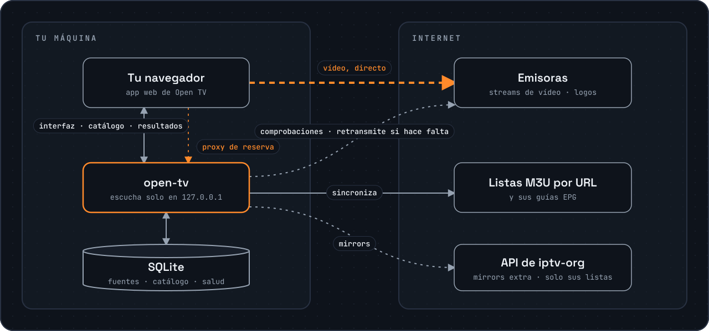

<!-- markdownlint-disable MD033 MD041 -->
<div align="center">



<p>
  <a href="https://github.com/gdberysan/open-tv/releases/latest"></a>
  <a href="https://github.com/gdberysan/open-tv/actions/workflows/ci.yml"></a>
  <a href="LICENSE"></a>
  
</p>

**Televisión abierta desde tus propias listas M3U, en el navegador, con un solo binario.**<br>
Sin cuentas. Sin telemetría. Sin nube. Y una señal honesta en cada canal: te
dice qué se va a ver de verdad antes de que hagas clic.

[Instalar](#instalar) · [Docker](#docker-verlo-en-cualquier-dispositivo-de-casa) · [Funciones](#funciones) · [Cómo funciona](#cómo-funciona) · [Privacidad](#privacidad) · [Limitaciones](#limitaciones-conocidas) · [FAQ](#preguntas-frecuentes) · **[English](README.md)**


</div>

---

## Instalar

```bash
# macOS (Homebrew)
brew install --cask gdberysan/tap/open-tv

# macOS y Linux (verifica el checksum antes de instalar)
curl -fsSL https://raw.githubusercontent.com/gdberysan/open-tv/main/install.sh | sh
```

Después, ejecuta `open-tv` y se abre el navegador con la app.

En Windows, o si prefieres una descarga directa, baja el archivo de tu sistema
desde [Releases](https://github.com/gdberysan/open-tv/releases/latest) y
compruébalo con `checksums.txt`. Para tenerlo en un servidor de casa y verlo
desde otros dispositivos, usa [Docker](#docker-verlo-en-cualquier-dispositivo-de-casa).

> **¿macOS y lo bajaste con el navegador?** El binario aún no está notarizado
> por Apple, así que Gatekeeper lo bloquea al primer arranque. Ejecuta una vez
> `xattr -d com.apple.quarantine ./open-tv`, o clic derecho → **Abrir** →
> **Abrir de todas formas**. Homebrew y el instalador por curl ya lo resuelven.

## Docker: verlo en cualquier dispositivo de casa

```bash
docker run -d --name open-tv -p 8080:8080 -v open-tv-data:/data \
  --restart unless-stopped ghcr.io/gdberysan/open-tv:latest

docker exec open-tv /open-tv access-key   # muestra la clave de acceso
```

Abre `http://<ip-del-servidor>:8080` en la tele, el móvil o el portátil y pega
la clave. Cada dispositivo sigue dentro durante 30 días. Para elegir tú la
clave, arranca el contenedor con `-e OPEN_TV_ACCESS_KEY=<una clave larga>`. En
el repo hay un [`compose.yaml`](compose.yaml) listo para usar.

- **Imágenes:** `linux/amd64` y `linux/arm64` (incluida una Raspberry Pi con
  sistema de 64 bits).
- **Datos:** todo vive en `/data`. La imagen corre con un usuario sin
  privilegios (UID 65532), así que un bind mount como `-v ./data:/data` tiene
  que poder escribirlo ese UID; un volumen con nombre como el de arriba no
  necesita nada.
- **Seguridad:** fuera de `127.0.0.1`, Open TV siempre pide la clave de
  acceso. Para llegar a él desde fuera de casa, ponlo detrás de un reverse
  proxy con HTTPS (Caddy, Traefik, nginx) en vez de abrir el puerto a
  Internet. El proxy debe reenviar la cabecera `Host` original (nginx:
  `proxy_set_header Host $host;`; Caddy y Traefik ya lo hacen) y debería
  mandar `X-Forwarded-Proto`, para que la cookie de sesión salga marcada
  `Secure`.

## Funciones

- **Un binario, cero configuración.** Un servidor Go con el cliente web
  embebido. Sin base de datos que instalar y sin media center. Descargas,
  ejecutas y ves.
- **Señal honesta.** Cada stream se comprueba en segundo plano: vivo o caído,
  latencia, resolución y si tu navegador puede decodificarlo. Los canales que
  no pueden dar imagen lo dicen, en vez de quedarse cargando para siempre.
- **Failover entre mirrors.** Un canal con varias fuentes las prueba por orden
  de salud hasta que una se ve.
- **El reproductor primero.** El vídeo sigue en pantalla mientras recorres el
  catálogo lateral; cambiar de canal lo sustituye en el sitio.
- **Paleta de comandos ⌘K** con búsqueda difusa, favoritos, «Continuar
  viendo» y atajos de teclado para reproducir, silenciar, pantalla completa y
  zapear.
- **AirPlay** a un Apple TV, **Picture-in-Picture** y pantalla completa.
- **Cualquier dispositivo de casa.** Tenlo en un servidor con Docker y ábrelo
  desde cualquier navegador de tu red, protegido con una clave de acceso.
- **Guía EPG** por fuente, cuando la lista la trae.
- **Tus propias listas.** Pega una URL M3U, sube un fichero o añade con un
  clic una de las listas públicas sugeridas de
  [iptv-org](https://github.com/iptv-org/iptv).
- **Interfaz en español e inglés.** Pensada para teclado y lectores de
  pantalla.

## Cómo funciona



Una instalación limpia arranca **vacía**: Open TV no trae canales. Las listas
las pones tú; la app las ordena y te dice la verdad sobre cada stream.

El vídeo va **directo de la emisora a tu navegador**; no pasa por open-tv. El
proxy integrado solo entra cuando el navegador no puede pedir un stream por sí
mismo (si faltan cabeceras CORS, o es un stream `http` en una página `https`),
y solo retransmite streams de tu catálogo. En segundo plano, el servidor
sincroniza tus listas y guías y comprueba cada stream leyendo su playlist y el
principio de su primer segmento de vídeo.

## Privacidad

- Sin cuentas, sin registro, sin nube.
- Sin telemetría: no se envía nada a Korven ni a nadie. El único tráfico va a
  las listas, guías y emisoras que añades (ver el diagrama de arriba).
- Tus fuentes, el catálogo, el historial de salud de cada stream y las claves
  viven en el directorio de datos local. Los favoritos y «Continuar viendo»
  viven en tu navegador.
- Por defecto el servidor escucha en `127.0.0.1` y no pide acceso. Si escucha
  en cualquier otra dirección (como en la imagen de Docker), cada petición
  exige la clave de acceso.

## Lo que no hace

Open TV es, a propósito, solo un reproductor de televisión abierta:

- Sin canales premium ni de pago, sin DRM y sin saltarse DRM.
- Sin geo-bypass ni VPN: si tu región bloquea un stream, sigue bloqueado.
- No aloja ni retransmite nada: solo reproduce las URLs que tú añades. Esas
  fuentes son responsabilidad tuya.

## Limitaciones conocidas

- **Algunos códecs nunca se ven en un navegador.** Unos pocos canales emiten
  vídeo MPEG-2, que ningún navegador decodifica. Open TV lo detecta y lo dice;
  para esos, usa VLC.
- **Los canales van y vienen.** Las listas públicas cambian a diario. Que un
  canal concreto no se vea casi siempre es cosa del stream, no de la app.
- **El geobloqueo** lo aplican las emisoras, y Open TV no lo esquiva.
- **Una clave de acceso, sin cuentas de usuario.** Quien tenga la clave ve el
  mismo catálogo y puede gestionar sus fuentes.
- **Binarios sin firmar.** Ni el de macOS ni el de Windows están firmados
  todavía (ver la nota de macOS en [Instalar](#instalar)).
- **Sin Chromecast todavía.** AirPlay funciona; Chromecast está planeado.

## Preguntas frecuentes

**¿Trae canales?** No. Arranca vacía; añades tu propia lista M3U o una de las
sugeridas de iptv-org.

**¿Es legal?** Open TV no aloja ni distribuye nada. Es un reproductor de
listas que tú decides añadir, y la legalidad de esas listas depende de ti y
de tu jurisdicción. Las sugeridas son la colección comunitaria de iptv-org de
streams de televisión abierta disponibles públicamente.

**¿Recoge algún dato?** No. Ver [Privacidad](#privacidad).

**¿Puedo verlo en la tele o en el móvil?** Sí: arráncalo con
[Docker](#docker-verlo-en-cualquier-dispositivo-de-casa) (o con `LISTEN_ADDR`
en tu dirección de red) y ábrelo desde el navegador del dispositivo. Desde
Safari en un Mac también puedes mandar la imagen a un Apple TV con AirPlay.

**He perdido la clave de acceso.** Ejecuta `open-tv access-key`, o
`docker exec open-tv /open-tv access-key` en Docker. Para cambiarla, fija
`OPEN_TV_ACCESS_KEY`, o borra el fichero `access-key` del directorio de datos
y reinicia; todos los dispositivos tendrán que volver a entrar.

**¿Cómo lo desinstalo?** Borra el binario (o `brew uninstall --cask
open-tv`). Para borrar también el catálogo, elimina el directorio de datos:
`~/Library/Application Support/Korven Open TV` en macOS,
`$XDG_DATA_HOME/korven-open-tv` (o `~/.local/share/korven-open-tv`) en Linux,
`%APPDATA%\Korven Open TV` en Windows. En Docker:
`docker rm -f open-tv && docker volume rm open-tv-data`.

## Comandos y variables

```bash
open-tv                # arranca el servidor y abre el navegador
open-tv --no-browser   # arranca sin abrir el navegador
open-tv --version      # muestra la versión
open-tv access-key     # muestra la clave de acceso del modo red
open-tv healthcheck    # sale con 0 si el servidor local está sano (lo usa Docker)
```

Si ya hay un `open-tv` corriendo, lanzarlo otra vez solo abre el navegador en
el que ya está vivo. Ctrl-C lo detiene.

| Variable | Default | Para qué sirve |
|---|---|---|
| `LISTEN_ADDR` | `127.0.0.1:8080` | Dirección de escucha. Cualquier cosa que no sea loopback activa el modo red, que exige la clave de acceso. Si el puerto está ocupado, usa el siguiente libre. |
| `OPEN_TV_ACCESS_KEY` | generada | Clave de acceso del modo red. Si no se fija, se genera en el primer arranque y se guarda junto a la base de datos. |
| `DB_PATH` | directorio de datos del sistema | Ruta del SQLite del catálogo. La clave de acceso y la clave de firma del proxy se guardan en el mismo directorio. |
| `SYNC_INTERVAL` | `12h` | Cada cuánto se re-sincronizan las fuentes. |
| `HEALTH_INTERVAL` | `60m` | Cada cuánto se comprueban los streams. |

## Contribuir y soporte

- Fallos e ideas: [GitHub Issues](https://github.com/gdberysan/open-tv/issues).
  Mira antes el [issue de limitaciones conocidas](https://github.com/gdberysan/open-tv/issues/7).
- ¿Vas a mandar código? Lee antes [`CONTRIBUTING.md`](CONTRIBUTING.md): dice
  qué encaja en el proyecto y qué no.
- ¿Un fallo de seguridad? No abras un issue público; ver
  [`SECURITY.md`](SECURITY.md).
- [`CODE_OF_CONDUCT.md`](CODE_OF_CONDUCT.md) explica cómo se trata la gente
  por aquí.

### Compilar desde el código fuente

```bash
cd web && npm ci && npm run build   # compila el cliente en internal/ui/dist
cd .. && go build -o open-tv ./cmd/open-tv

docker build -t open-tv .           # o construye la imagen de Docker
```

El cliente web hay que compilarlo antes: `go build` lo embebe, así que un
binario compilado sin él (también un `go install` a secas) no sirve ninguna
interfaz.

Pruebas: `go test -race ./...` y `cd web && npm run check && npm test`. CI
corre el conjunto completo, más las pruebas de punta a punta con Playwright,
una prueba de humo de Docker y análisis de seguridad, en cada push.

La app nativa de macOS de `mobile/` (Flutter) está congelada: sigue
compilando, pero el producto es el cliente web. `IPTV_ORG_URL` es un atajo de
desarrollo que da de alta una fuente al arrancar, y en `tools/` hay una
plantilla de LaunchAgent de macOS para tener el servidor corriendo mientras
desarrollas.

## Licencia y marca

Código bajo licencia **MIT** — ver [`LICENSE`](LICENSE) y
[`NOTICE`](NOTICE). Los nombres «Korven» y «Korven Open TV», el wordmark, el
emblema y el icono de la app **no** están cubiertos por ella
([`assets/brand/LICENSE`](assets/brand/LICENSE)): si publicas un fork, usa tu
propio nombre y emblema.

Una obra de **[Korven](https://korven.dev)** — *del núcleo a la obra*.
