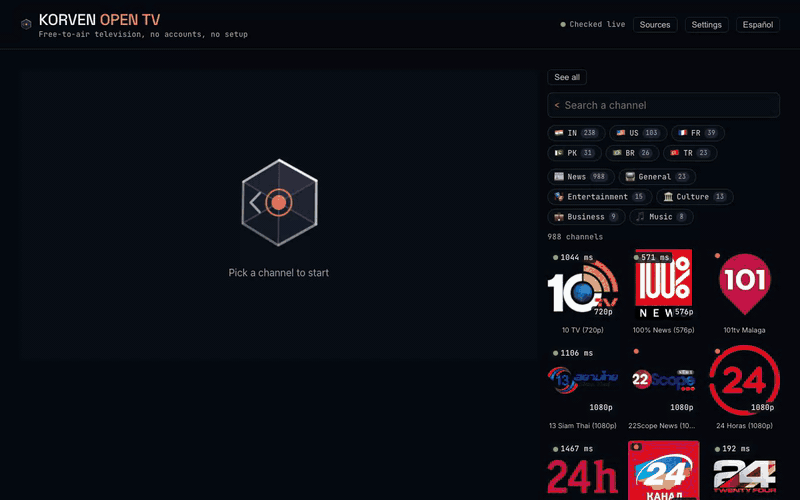
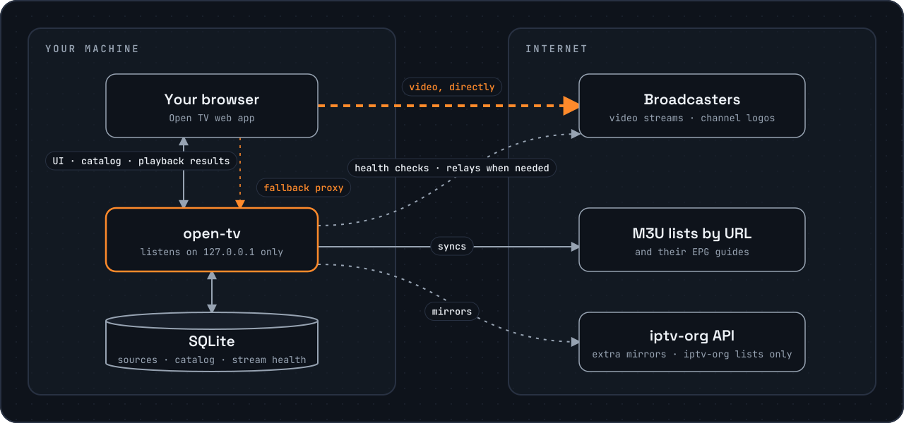

<!-- markdownlint-disable MD033 MD041 -->
<div align="center">



<p>
  <a href="https://github.com/gdberysan/open-tv/releases/latest"></a>
  <a href="https://github.com/gdberysan/open-tv/actions/workflows/ci.yml"></a>
  <a href="LICENSE"></a>
  
</p>

**Watch free-to-air TV from your own M3U lists, in your browser, from one binary.**<br>
No accounts. No telemetry. No cloud. And an honest signal on every channel —
it tells you what will actually play before you click.

[Install](#install) · [Features](#features) · [How it works](#how-it-works) · [Privacy](#privacy) · [Limitations](#known-limitations) · [FAQ](#faq) · **[Español](README.es.md)**



</div>

---

## Install

```bash
# macOS (Homebrew)
brew install --cask gdberysan/tap/open-tv

# macOS and Linux (verifies the checksum before installing)
curl -fsSL https://raw.githubusercontent.com/gdberysan/open-tv/main/install.sh | sh

# Anywhere with Go
go install github.com/gdberysan/open-tv/cmd/open-tv@latest
```

Then run `open-tv`. Your browser opens on the app.

Windows, and anyone who prefers a plain download: grab the archive for your
system from [Releases](https://github.com/gdberysan/open-tv/releases/latest)
and check it against `checksums.txt`.

> **macOS, downloaded with a browser?** The binary isn't notarized by Apple
> yet, so Gatekeeper blocks it on first launch. Run
> `xattr -d com.apple.quarantine ./open-tv` once, or right-click → **Open** →
> **Open Anyway**. Homebrew and the curl installer handle this for you.

## Features

- **One binary, zero setup.** A Go server with the web client embedded. No
  database to install, no Docker, no media center. Download, run, watch.
- **Honest signal.** Every stream is health-checked in the background: alive
  or down, latency, resolution, and whether your browser can decode it at
  all. Channels that can't show a picture say so instead of spinning forever.
- **Failover across mirrors.** A channel with several sources tries them in
  order of health until one plays.
- **Player first.** The video stays on screen while you browse the catalog on
  the side; switching channels swaps it in place.
- **⌘K command palette** with fuzzy search, favorites, "continue watching",
  and keyboard shortcuts for play, mute, fullscreen and channel surfing.
- **AirPlay** to an Apple TV, **picture-in-picture** and fullscreen.
- **EPG guide** per source, when the list provides one.
- **Bring your own lists.** Paste an M3U URL, upload a file, or add one of
  the suggested public lists from [iptv-org](https://github.com/iptv-org/iptv)
  with one click.
- **English and Spanish** interface. Keyboard-first and screen-reader
  friendly.

## How it works



A clean install starts **empty**: Open TV ships with no channels. You add the
lists; it keeps them in order and tells you the truth about each stream.

Video goes **straight from the broadcaster to your browser**; it doesn't pass
through open-tv. The local proxy only steps in when the browser can't fetch a
stream itself (missing CORS headers, or an `http` stream on an `https` page),
and it never listens outside your machine. The server does its own traffic in
the background: syncing your lists and guides, and health-checking streams by
reading each playlist and the start of its first video segment.

## Privacy

- No accounts, no sign-up, no cloud.
- No telemetry: nothing is sent to Korven or anyone else. The only traffic
  goes to the lists, guides and broadcasters you add (see the diagram above).
- Your sources, the catalog and each stream's health history live in a local
  SQLite file. Favorites and "continue watching" live in your browser.
- The server binds to `127.0.0.1`, has no authentication, and isn't meant to
  be exposed to a network.

## What it doesn't do

Open TV is, on purpose, only a free-to-air player:

- No premium or paid channels, no DRM and no DRM circumvention.
- No geo-bypass or VPN: if your region blocks a stream, it stays blocked.
- No hosting or rebroadcasting: it only plays URLs that you add. Those
  sources are your responsibility.

## Known limitations

- **Some codecs never play in a browser.** A few channels broadcast MPEG-2
  video, which no browser decodes. Open TV detects them and says so; use VLC
  for those.
- **Channels come and go.** Public lists change daily. A single channel not
  playing is almost always the stream, not the app.
- **Geo-blocking** is enforced by broadcasters and Open TV doesn't work
  around it.
- **Unsigned binaries.** Neither the macOS nor the Windows build is signed
  yet (see the macOS note under [Install](#install)).
- **No Chromecast yet.** AirPlay works; Chromecast is planned.
- **No Docker image yet.** The proxy is deliberately locked to loopback, which
  a container network breaks. A safe design for it is on the roadmap.

## FAQ

**Does it come with channels?** No. It starts empty; you add your own M3U
list or one of the suggested iptv-org lists.

**Is it legal?** Open TV hosts and distributes nothing. It's a player for
lists you choose to add, and the legality of those lists depends on you and
your jurisdiction. The suggested lists are iptv-org's community collection of
publicly available free-to-air streams.

**Does it collect any data?** No. See [Privacy](#privacy).

**How do I uninstall it?** Remove the binary (or `brew uninstall --cask
open-tv`). To also delete the catalog, remove the data directory:
`~/Library/Application Support/Korven Open TV` on macOS,
`$XDG_DATA_HOME/korven-open-tv` (or `~/.local/share/korven-open-tv`) on
Linux, `%APPDATA%\Korven Open TV` on Windows.

## Commands and variables

```bash
open-tv                # start the server and open the browser
open-tv --no-browser   # start without opening the browser
open-tv --version      # print the version
```

Running `open-tv` again while one is already running just opens the browser
on the existing one. Ctrl-C stops it.

| Variable | Default | What it's for |
|---|---|---|
| `LISTEN_ADDR` | `127.0.0.1:8080` | Listen address. **Don't expose it to a network**: the API has no authentication. If the port is taken, the next free one is used. |
| `DB_PATH` | system data directory | Path to the catalog's SQLite file. |
| `SYNC_INTERVAL` | `12h` | How often sources are re-synced. |
| `HEALTH_INTERVAL` | `60m` | How often streams are health-checked. |

## Contributing and support

- Bugs and ideas: [GitHub Issues](https://github.com/gdberysan/open-tv/issues).
- Sending code? Read [`CONTRIBUTING.md`](CONTRIBUTING.md) first; it says what
  fits the project and what doesn't.
- Security issue? Don't open a public issue; see [`SECURITY.md`](SECURITY.md).
- [`CODE_OF_CONDUCT.md`](CODE_OF_CONDUCT.md) covers how people are treated
  here.

### Building from source

```bash
cd web && npm ci && npm run build   # builds the client into internal/ui/dist
cd .. && go build -o open-tv ./cmd/open-tv
```

Tests: `go test -race ./...` and `cd web && npm run check && npm test`. CI
runs the full set, plus security scans, on every push.

The native macOS app in `mobile/` (Flutter) is frozen: it still builds, but
the web client is the product. `IPTV_ORG_URL` is a development shortcut that
registers a source on startup, and `tools/` has a macOS LaunchAgent template
for running the server during development.

## License and brand

Code under the **MIT** license — see [`LICENSE`](LICENSE) and
[`NOTICE`](NOTICE). The "Korven" and "Korven Open TV" names, wordmark, emblem
and app icon are **not** covered by it
([`assets/brand/LICENSE`](assets/brand/LICENSE)): if you publish a fork, use
your own name and emblem.

A work by **[Korven](https://korven.dev)** — *from the core to the work*.
